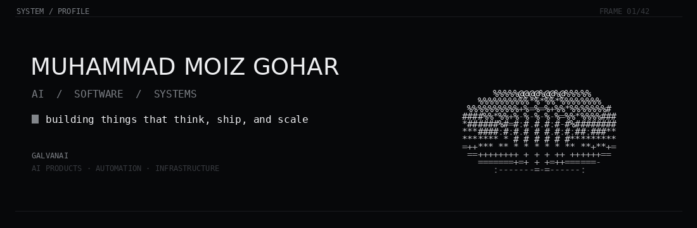

<div align="center">



</div>

<br>

## I build and operate AI products and software systems.

I'm **Muhammad Moiz Gohar**, COO at **[GalvanAI](https://www.galvanai.com/)**.

My work sits between **product, engineering, operations, and AI** - taking ideas from early discovery and architecture to production, delivery, and scale. I still like being close to the technical work, but my focus today is broader: building the systems, teams, processes, and products that make good engineering repeatable.

At GalvanAI, I work across applied AI, automation, full-stack products, infrastructure, and technical delivery. I care about products that solve a real problem, survive outside a demo, and get better as they scale.

`AI Systems` · `Product Engineering` · `Technical Operations` · `Automation` · `Cloud`

<br>

## Skills

### UI / Motion


&nbsp;


**CSS · GSAP · Motion**


### Frontend


**React · Next.js · Remix · Vite · TypeScript**


### Backend


**JavaScript · Python · Node.js · Express · Flask · FastAPI**

I build APIs, application backends, real-time services, integrations, authentication flows, background processing, and the application logic behind AI-enabled products.


### Databases / Data Layer


**SQLite · PostgreSQL · MySQL · MongoDB · Redis**


### Cloud


**AWS · Google Cloud Platform**


### DevOps / MLOps


**Docker · Kubernetes · GitHub Actions · Jenkins · Nginx · Terraform · Airflow · MLflow**

From containerized applications and CI/CD to cloud deployments, observability, model workflows, and the infrastructure needed to move from prototype to production.


### AI / Automation

<p>
  
</p>

<p>
  
  
  
  
</p>

**Codex · Claude · OpenAI APIs · Gemini · Vapi · n8n · Make · ElevenLabs**

I use AI as part of the engineering stack - for intelligent workflows, voice systems, agents, RAG, automation, product features, development acceleration, and internal operations.

<br>

## What I'm focused on

- **Operating technical teams** - turning product goals into clear execution, ownership, and delivery.
- **Building AI products** - not isolated demos, but systems designed for real users and real workflows.
- **Engineering for production** - architecture, APIs, infrastructure, deployment, reliability, and scale.
- **Automation** - replacing repetitive operational work with intelligent workflows and agents.
- **Product development** - moving from problem definition to validation, launch, iteration, and growth.
- **Growing builders** - creating environments where engineers can own problems, review each other's work, and improve quickly.

<br>

## How I like to build

```text
define the problem
      ↓
design the system
      ↓
validate quickly
      ↓
ship to real users
      ↓
measure + improve
      ↓
scale what works
```

I prefer useful systems over impressive prototypes and simple architecture over unnecessary complexity.

<br>

## Currently

**COO @ [GalvanAI](https://www.galvanai.com/)**

Building and operating across AI products, automation, software delivery, infrastructure, and the teams behind them.

<br>

[LinkedIn](https://www.linkedin.com/in/moiz-gohar/) · [GalvanAI](https://www.galvanai.com/) · [Repositories](https://github.com/moiz-gohar?tab=repositories)

<br>

<sub>build → validate → ship → operate → scale</sub>
